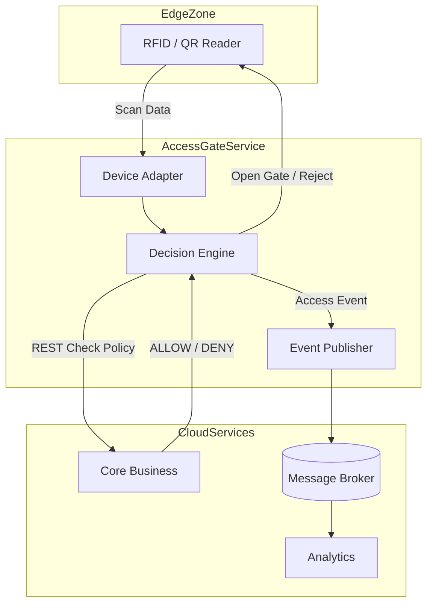

# Service Boundary của nhóm

## 1. Thông tin nhóm

- Tên nhóm: Nhóm 3-(A3)
- Lớp: CNTT 17-11
- Thành viên: Đặng Văn Thanh, Lương Duy Chiến, Đặng Thành Đạt
- Service nhóm phụ trách: Access Gate
- Sản phẩm tổng thể của lớp: Smart Campus Operations Platform

## 2. Actor

- **Người dùng cuối (Sinh viên/Giảng viên/Nhân viên/Khách):** Tương tác vật lý thông qua việc quét thẻ RFID, mã sinh viên, mã nhân viên hoặc mã QR.
- **Thiết bị phần cứng (Hardware):** Các đầu đọc (Reader) tại cổng gửi dữ liệu quét về service.

## 3. System Boundary

**Phần nhóm kiểm soát:**
- Logic tiếp nhận yêu cầu từ cổng và xử lý định dạng dữ liệu đầu vào.
- Cơ chế kết nối REST sync với Core Business để kiểm tra quyền.
- Cơ chế đẩy log bất đồng bộ (Async) tới Analytics.
- API trả kết quả điều khiển (Open/Deny) cho thiết bị phần cứng.

**Phần nhóm chỉ tích hợp:**
- Database (lưu trữ log tạm thời tại edge).
- Các hệ thống Core Business (để xác thực) và Analytics (để phân tích).

## 4. Service Boundary

**Trách nhiệm**
- Tiếp nhận dữ liệu quét từ thiết bị phần cứng.
- Giao tiếp REST sync với Core Business để xác thực quyền ra/vào theo thời gian thực.
- Trả lệnh điều khiển (Mở/Đóng) về cho cổng vật lý.
- Đẩy log (Event telemetry) vào Message Queue phục vụ Analytics.

**Không thuộc phạm vi**
- Quản lý danh sách người dùng (User Profiles).
- Định nghĩa rule/policy phân quyền.
- Tính toán báo cáo số liệu chuyên sâu.
- Quản lý trạng thái hoạt động của thiết bị cổng (chỉ trả về mock).
- Lưu trữ log lâu dài (chỉ giữ tạm trên Redis).

## 5. Input / Output

### Input
```json
{
  "card_id": "RFID-2026-001",
  "gate_id": "gate-main",
  "direction": "IN",
  "timestamp": "2026-05-02T07:30:00"
}
```

### Output
```json
{
  "access_granted": true,
  "reason": "Valid student card",
  "person_id": "SV001"
}
```

## 6. API dự kiến

| Method | Endpoint | Mục đích |
|---|---|---|
| GET | `/health` | Kiểm tra trạng thái hoạt động của service |
| POST| `/access/check` | Kiểm tra policy ra/vào realtime |
| GET | `/access/logs/{logId}` | Truy vấn chi tiết một log theo ID |
| GET | `/access/logs/recent` | Truy vấn danh sách log ra/vào gần đây |
| GET | `/gates/{gateId}/status` | Truy vấn trạng thái hiện tại của một cổng cụ thể |
| GET | `/cards/{cardId}` | Truy vấn thông tin thẻ (trạng thái, người dùng liên quan) |

## 7. Phụ thuộc service khác

**Service này gọi đến service nào?**
- Gọi đến service **Analytics** để "Feed log ra/vào cho thống kê" qua cơ chế Queue async.
- Gọi đến service **Core Business** để "Kiểm tra policy ra/vào realtime" qua cơ chế REST sync.

**Service nào gọi đến service này?**
- Service **Core Business** gọi đến để "Nhận log quẹt thẻ / kiểm tra quyền" qua cơ chế REST sync.

## 8. Sơ đồ minh họa

